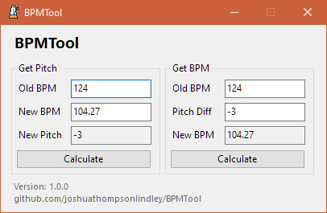

# BPMTool

A tool for calculating BPM and Pitch based on different changes to a sample. Built in WinForms and .NET Core 3.1

This tool was originally made for personal use, but I added a WindowsForms GUI and decided to release it.

## Usage:

Launch the application and fill in the appropriate fields and click calculate. Some figures could not be 100% accurate, or there might be a discrepancy in some calculations, this is due to the application rounding to 2 decimal places, as this is the standard for tempo and pitch in Ableton Live (as of 10.1.25). Your DAW/Audio tool may accept more or less precision in these values.

## Image:

## Notes:

Thanks to the following sources: 

-  [http://rachelnertia.github.io/programming/2018/02/02/pitch-to-bpm](http://rachelnertia.github.io/programming/2018/02/02/pitch-to-bpm) (Basic Algorithms)
-  [https://www.logicprohelp.com/forum/viewtopic.php?t=148012](https://www.logicprohelp.com/forum/viewtopic.php?t=148012) (Tuning and Interval Variables)
-  [http://www.thewhippinpost.co.uk/tools/tempo-pitch-calculator.htm](http://www.thewhippinpost.co.uk/tools/tempo-pitch-calculator.htm) (Source for above)
- Icon made by [Dimitry Miroliubov](https://www.flaticon.com/authors/dimitry-miroliubov) from [www.flaticon.com](https://www.flaticon.com/)